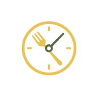

# ChefDesk

<p align="center">
  
</p>

<p align="center">
  
  
  
  
  
  
  
</p>

## Descripción
ChefDesk es una plataforma web todo-en-uno para la gestión eficiente de cocinas profesionales. Permite administrar inventario, personal, turnos, finanzas y mucho más, facilitando la digitalización y optimización de los procesos en restaurantes y negocios gastronómicos.

---

## Tecnologías Utilizadas

### Backend
- **Node.js** y **Express.js**: Servidor y API REST.
- **Base de datos**: SQLite (archivos `.sqlite`, `.db`).
- **JWT**: Autenticación y autorización.
- **Módulos propios**: Controladores, modelos, rutas y middlewares para la gestión de usuarios, empleados, inventario, menús, pedidos, roles, tareas, etc.

### Frontend
- **Angular 19**: Framework principal para la SPA.
- **Tailwind CSS**: Estilizado moderno y utilidades CSS.
- **PWA**: Soporte para Aplicación Web Progresiva (manifest, service worker, iconos).
- **ngx-sonner**: Notificaciones.

---

## Estructura del Proyecto

```
BACKEND/
  src/
    controllers/   # Lógica de negocio y endpoints
    models/        # Modelos de datos
    routes/        # Rutas de la API
    middleware/    # Middlewares de autenticación y validación
    config/        # Configuración de la base de datos
    helper/        # Funciones auxiliares
    images/        # Imágenes del sistema
  app.js           # Punto de entrada del backend
  package.json     # Dependencias y scripts

FRONTEND/
  src/
    app/           # Componentes, páginas, servicios y rutas
    assets/        # Imágenes y recursos estáticos
    styles.css     # Estilos globales
  public/
    manifest.webmanifest  # Manifest PWA
    icons/                # Iconos PWA
  package.json     # Dependencias y scripts
  angular.json     # Configuración Angular
```

---

## Cómo ejecutar el proyecto

### Backend
1. Ve a la carpeta `BACKEND`:
   ```sh
   cd BACKEND
   ```
2. Instala las dependencias:
   ```sh
   npm install
   ```
3. Inicia el servidor:
   ```sh
   npm start o npm run dev(desarrollo)
   ```
   El backend estará disponible normalmente en `http://localhost:3000`.

### Frontend
1. Ve a la carpeta `FRONTEND`:
   ```sh
   cd FRONTEND
   ```
2. Instala las dependencias:
   ```sh
   npm install
   ```
3. Inicia la aplicación Angular:
   ```sh
   npm start o ng s(desarrollo)
   ```
   La aplicación estará disponible en `http://localhost:4200`.

#### PWA
- Puedes instalar la app como PWA desde el navegador.
- El manifiesto y los iconos están en `public/`.


---

## Integrantes del Proyecto
- Bartolomé Miranda, Laura
- Donoso Escalona, David
- González Parra, Francisco
- Ibañez Escribano, César
- Mesa Gonzalez, Marcos
- Moreno Vaz, Gilson Jorge
- Pérez Mateos, Carlos
- Rodríguez Hernández, Himar
- Sendino Sanz, Rodrigo

---

¡Gracias por usar ChefDesk!
